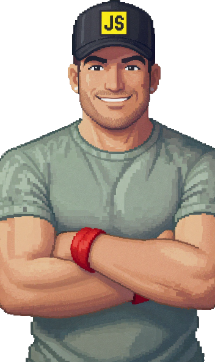

# Hi, I'm Oğuz 👋

I build things for people — tools, apps and sites — with a passion for design.
I don't believe creativity is a gift you're born with. I think you earn it the slow way:
by practicing a little every day.

I started as a manufacturing engineer (ITU), on factory floors, making production lines
work better. Since 2021 I've been a frontend developer (React, Vue, TypeScript), and I
still think like an engineer from the shop floor: find the bottleneck, make the work
simple, ship it.

## Things I make

-  **Quarterdeck** — a macOS app for running Claude Code sessions side by side, one color
  per session. *(coming soon)*
-  **[Growmanac](https://growmanac.com)** — tools and guides for growing your own food.
-  **[CoinGarden](https://thecoingarden.com)** — free investing and FIRE calculators.
-  **[Burr](https://app.burrapp.com)** — a five-move morning mobility routine; start
  without deciding.
-  **[distillio](https://distillio0.com)** — a study companion that helps students learn
  from their own material. *(in Turkish, in development)*
-  **IronBuild** — a bodyweight calisthenics app: open it, press start, follow one full-body
  session three times a week. *(coming soon)*

## Where I share

I document what I build and learn under **DemirCraftCo** — where the mind meets the craft.

## Now

Getting Quarterdeck 0.1 out the door.
